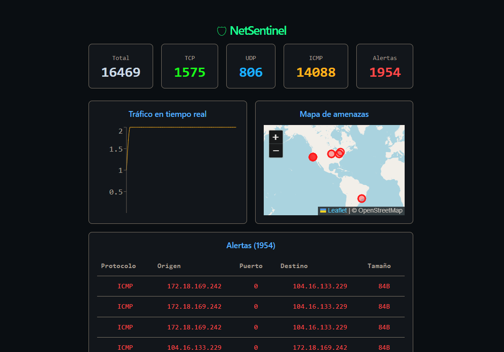

# NetSentinel

A real-time network intrusion detection system built in C and Python. Captures raw packets at the OS level, detects traffic anomalies, persists events to PostgreSQL, and streams live data to a React dashboard over WebSocket.



---

## Architecture

```
[C - libnetsentinel.so]
    Raw packet capture via AF_PACKET socket
    TCP / UDP / ICMP parsing
    Per-IP traffic spike detection with mutex-protected state

[Python - main.py]
    ctypes bridge to the C library
    FastAPI + WebSocket server
    Async event persistence to PostgreSQL via asyncpg
    Multi-client broadcast manager

[React - netsentinel-frontend]
    Live traffic chart (Recharts)
    Geographic threat map (Leaflet + ip-api.com geolocation)
    Alerts table
    Protocol stats bar
```

## Stack

- C (raw sockets, pthreads)
- Python 3.12, FastAPI, asyncpg, uvicorn
- PostgreSQL 16
- React 19, Vite, Recharts, React-Leaflet
- Docker

---

## Requirements

- Linux or WSL2
- Python 3.12+
- Node 20+
- Docker and Docker Compose
- Root privileges (required for raw socket capture)

---

## Setup

**1. Start PostgreSQL**

```bash
cd ~/docker/netsentinel
docker compose up -d
```

**2. Create the events table**

```bash
docker exec -it netsentinel-postgres-1 psql -U sentinel -d netsentinel
```

```sql
CREATE TABLE events (
    id SERIAL PRIMARY KEY,
    ts TIMESTAMPTZ DEFAULT NOW(),
    src_ip INET,
    dst_ip INET,
    src_port INT,
    dst_port INT,
    protocol VARCHAR(10),
    size INT,
    is_alert BOOLEAN
);
```

**3. Compile the C library**

```bash
gcc -shared -fPIC -o libnetsentinel.so sentinel.c -lpthread
```

**4. Install Python dependencies**

```bash
python3 -m venv venv
source venv/bin/activate
pip install fastapi uvicorn asyncpg
```

**5. Run the backend**

```bash
sudo ./venv/bin/python3 main.py
```

**6. Run the frontend**

```bash
cd netsentinel-frontend
npm install
npm run dev
```

Open `http://localhost:5173` in your browser.

---

## Detection

NetSentinel flags a source IP as an alert when it sends more than 50 packets within a single second. The threshold is defined in `sentinel.c`:

```c
#define ALERT_THRESHOLD 50
```

Alerts are surfaced in the dashboard and stored in PostgreSQL with `is_alert = true`.

---

## Project structure

```
netsentinel/
    sentinel.c              C library: packet capture and spike detection
    main.py                 Python backend: FastAPI, WebSocket, DB persistence
    netsentinel-frontend/   React dashboard
    docker-compose.yml      PostgreSQL service
```

---

## Roadmap

- Redis + Celery for async enrichment (GeoIP database, IP blacklists)
- PCAP file export from C
- Power BI integration via PostgreSQL connector
- Proper authentication for the dashboard

---

---

# NetSentinel (español)

Sistema de detección de intrusiones de red en tiempo real, construido en C y Python. Captura paquetes crudos a nivel de sistema operativo, detecta anomalías de tráfico, persiste eventos en PostgreSQL y transmite datos en vivo a un dashboard React via WebSocket.

---

## Arquitectura

```
[C - libnetsentinel.so]
    Captura raw via socket AF_PACKET
    Parseo de TCP / UDP / ICMP
    Detección de spikes por IP con estado protegido por mutex

[Python - main.py]
    Bridge a la librería C via ctypes
    Servidor FastAPI + WebSocket
    Persistencia asíncrona a PostgreSQL via asyncpg
    Broadcaster multi-cliente

[React - netsentinel-frontend]
    Gráfico de tráfico en tiempo real (Recharts)
    Mapa geográfico de amenazas (Leaflet + geolocalización via ip-api.com)
    Tabla de alertas
    Barra de estadísticas por protocolo
```

## Stack

- C (raw sockets, pthreads)
- Python 3.12, FastAPI, asyncpg, uvicorn
- PostgreSQL 16
- React 19, Vite, Recharts, React-Leaflet
- Docker

---

## Requisitos

- Linux o WSL2
- Python 3.12+
- Node 20+
- Docker y Docker Compose
- Permisos de root (requeridos para captura de raw sockets)

---

## Instalación

**1. Levantar PostgreSQL**

```bash
cd ~/docker/netsentinel
docker compose up -d
```

**2. Crear la tabla de eventos**

```bash
docker exec -it netsentinel-postgres-1 psql -U sentinel -d netsentinel
```

```sql
CREATE TABLE events (
    id SERIAL PRIMARY KEY,
    ts TIMESTAMPTZ DEFAULT NOW(),
    src_ip INET,
    dst_ip INET,
    src_port INT,
    dst_port INT,
    protocol VARCHAR(10),
    size INT,
    is_alert BOOLEAN
);
```

**3. Compilar la librería C**

```bash
gcc -shared -fPIC -o libnetsentinel.so sentinel.c -lpthread
```

**4. Instalar dependencias Python**

```bash
python3 -m venv venv
source venv/bin/activate
pip install fastapi uvicorn asyncpg
```

**5. Correr el backend**

```bash
sudo ./venv/bin/python3 main.py
```

**6. Correr el frontend**

```bash
cd netsentinel-frontend
npm install
npm run dev
```

Abrí `http://localhost:5173` en el navegador.

---

## Detección

NetSentinel marca una IP como alerta cuando supera 50 paquetes en un segundo. El umbral está definido en `sentinel.c`:

```c
#define ALERT_THRESHOLD 50
```

Las alertas se muestran en el dashboard y se guardan en PostgreSQL con `is_alert = true`.

---

## Estructura del proyecto

```
netsentinel/
    sentinel.c              Librería C: captura y detección de spikes
    main.py                 Backend Python: FastAPI, WebSocket, persistencia
    netsentinel-frontend/   Dashboard React
    docker-compose.yml      Servicio PostgreSQL
```

---

## Roadmap

- Redis + Celery para enriquecimiento asíncrono (base de datos GeoIP, blacklists de IPs)
- Exportación de capturas a formato PCAP desde C
- Integración con Power BI via conector PostgreSQL
- Autenticación para el dashboard